# PyFlink Weather Stream Processing Pipeline 🌊⚡

[](https://github.com/Toya62/pyflink-weather-stream-pipeline/actions/workflows/ci.yml)
[](https://flink.apache.org)
[](https://www.python.org)
[](https://opensource.org/licenses/MIT)

A real-time streaming ETL and incremental window aggregation pipeline built with **Apache Flink** and the **PyFlink DataStream API**. It ingests continuous meteorological telemetry, applies stateful filtering, tracks historical extrema, and computes tumbling window statistics (averages, minimums, maximums for precipitation and wind speed) with low latency.

---

## 🏗️ Stream Processing Architecture

The pipeline processes continuous JSON-formatted weather telemetry records through a chain of streaming transformations:

```mermaid
flowchart LR
    A[Telemetry Stream Source\nJSON Records] -->|Line Stream| B[ProcessLine Operator\nSanitization & Trimming]
    B -->|Cleaned Record| C[FilterByCity Operator\nStation Predicate Filter]
    C -->|City Matched| D[TrackMinMax Operator\nStateful Historical Extrema]
    D -->|Enriched Record| E[CountTumblingWindowAssigner\nBatching of N Elements]
    E -->|Window Trigger| F[WeatherDataAggregator\nIncremental AggregateFunction]
    F -->|Aggregated Metrics| G[Output Sink / Print\nReal-Time Telemetry Metrics]
```



---

## 🚀 Key Architectural Features

- **DataStream API Architecture**: Built natively on Apache Flink's streaming runtime (`RuntimeExecutionMode.STREAMING`) with configurable execution parallelism.
- **Incremental Window Aggregation**: Implements a custom `AggregateFunction` (`WeatherDataAggregator`). Rather than buffering entire windows in memory before reducing, incoming elements are incrementally folded into accumulator states (`create_accumulator`, `add`, `merge`, `get_result`), maintaining a strictly constant $O(1)$ memory footprint per window.
- **Stateful Streaming Operators**: Features stateful tracking (`TrackMinMax`) that maintains running lifetime minimums and maximums across streaming events without external database lookups.
- **Configurable Window Semantics**: Supports customizable tumbling count windows to evaluate localized meteorological patterns over continuous micro-batches.
- **Production-Ready CLI**: Fully configurable via command-line arguments (`--input`, `--city`, `--window-size`, `--parallelism`).

---

## 📁 Repository Structure

```text
pyflink-weather-stream-pipeline/
├── .github/
│   └── workflows/ci.yml       # Automated GitHub Actions CI for unit testing
├── data/
│   └── sample_weather.jsonl   # Curated sample meteorological telemetry stream
├── src/
│   ├── __init__.py
│   ├── operators.py           # Stateful streaming operators (ProcessLine, FilterByCity, TrackMinMax)
│   ├── aggregators.py         # Incremental WeatherDataAggregator (PyFlink AggregateFunction)
│   └── pipeline.py            # StreamExecutionEnvironment definition & CLI entry point
├── tests/
│   └── test_pipeline.py       # Automated unit tests for operators, state tracking, and aggregators
├── .gitignore                 # Ignores bytecode, virtualenvs, and raw dumps
├── LICENSE                    # MIT License
├── requirements.txt           # Project dependencies (apache-flink, pytest)
└── README.md                  # Comprehensive stream processing architecture guide
```

---

## 🛠️ Quickstart & Execution

### Prerequisites
- Python 3.10 or 3.11
- Java 11 or 17 (Required by Apache Flink runtime engine)

### 1. Installation
```bash
git clone https://github.com/Toya62/pyflink-weather-stream-pipeline.git
cd pyflink-weather-stream-pipeline

python -m venv .venv
source .venv/bin/activate
pip install -r requirements.txt
```

### 2. Run the Streaming Pipeline
Run the pipeline against the included sample weather telemetry dataset:
```bash
python src/pipeline.py --input data/sample_weather.jsonl --city Sidney --window-size 10
```

#### CLI Options:
| Flag | Description | Default |
|---|---|---|
| `--input` | Path to the newline-delimited JSON stream file | `data/sample_weather.jsonl` |
| `--city` | Target station city filter | `Sidney` |
| `--window-size` | Number of events per tumbling count window | `10` |
| `--parallelism` | Degree of Flink task execution parallelism | `1` |

### Sample Aggregated Window Output:
```json
{
  "total_records": 10,
  "avg_precipitation": 0.084,
  "min_precipitation": 0.0,
  "max_precipitation": 0.42,
  "avg_wind_speed": 7.32,
  "min_wind_speed": 3.86,
  "max_wind_speed": 14.2
}
```

---

## 🧪 Unit Testing

The test suite validates state transitions, accumulator mathematical correctness, and partition merge logic independently without requiring a live Flink cluster:

```bash
python3 -m unittest discover -s tests -v
```

### Test Coverage Highlights:
- ✅ **Operator Sanitization**: Verifies whitespace trimming on raw stream lines.
- ✅ **Predicate Filtering**: Tests JSON parsing, city matching, and malformed record rejection.
- ✅ **Stateful Running Extrema**: Validates monotonically updating minimums and maximums across arbitrary stream sequences.
- ✅ **Window Aggregation Lifecycle**: Tests incremental accumulator creation, element ingestion, and final projection.
- ✅ **Distributed Accumulator Merge**: Validates parallel partition merging across distributed worker tasks.

---

## 📄 License
This project is open-source and licensed under the [MIT License](LICENSE).
